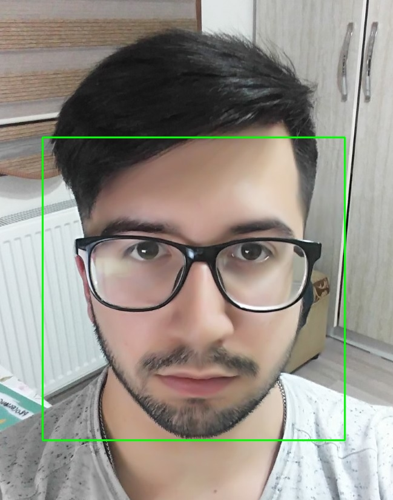
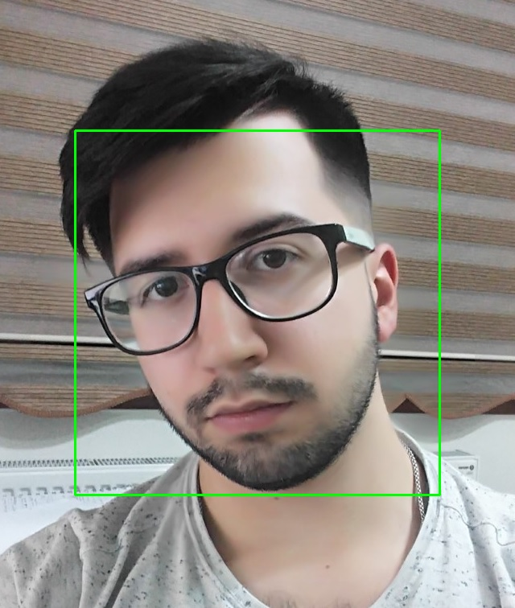

# Face_detection

First we have haar_cascade trained file for different faces.

In the code we call the haar_cascade file then we call our own picture.Later stages in the code we tell it to draw faces on the found ones.

